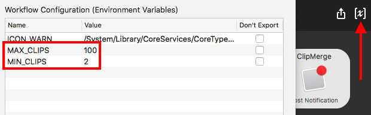

# clipmerge-alfred-workflow
**Merge the last N clipboards**

_(I'll update this shortly with better notes & screenshots)_

Download: [v1.0.2](https://github.com/luckman212/clipmerge-alfred-workflow/blob/master/ClipMerge_1.0.2.alfredworkflow?raw=true)

Trigger with keyword `cm` (no space afterward) e.g. `cm7`

You can set your own MIN_CLIPS and MAX_CLIPS by going into the variables section of the workflow:

Discussion on Alfred forum:
https://www.alfredforum.com/topic/12190-merge-last-n-number-of-clipboards/
